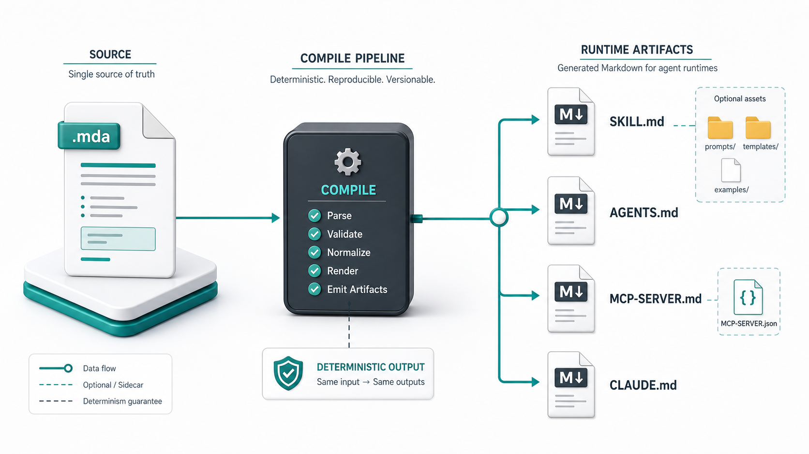
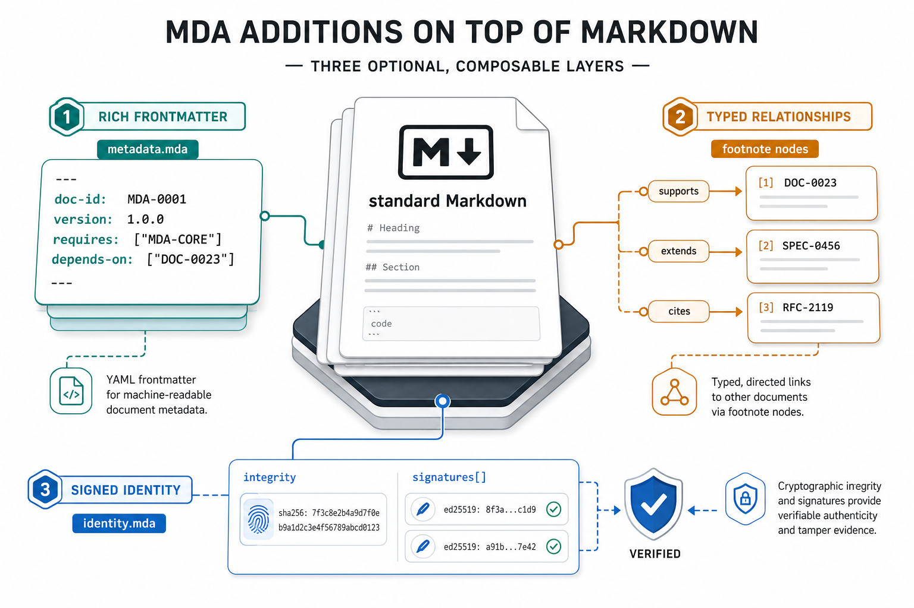
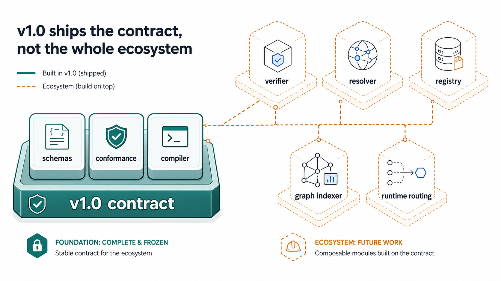

# 📝 MDA Open Spec — Markdown для агентов

> Надмножество Markdown для документов, ориентированных на агентов. **Один источник, множество целей** — компилируется в `.md`-файлы, которые уже умеют загружать все основные runtime-окружения агентов. **Защита от подмены при загрузке** — каждый артефакт несёт воспроизводимый дайджест содержимого, а подписанные артефакты — подписи, заякоренные в Sigstore. Ни агенту, загружающему документ, ни человеку, проверяющему его, не придётся доверять неподписанному blob'у.

[](https://github.com/sno-ai/mda/releases/tag/v1.0.0-rc.3)
[](https://github.com/sno-ai/mda/blob/main/LICENSE)
[](https://mda.sno.dev)
[](https://github.com/sno-ai/mda/stargazers)

**Читать на других языках:** [English](../../README.md) · [中文](README.zh-CN.md) · [Deutsch](README.de.md) · [Español](README.es.md) · [Français](README.fr.md) · **Русский** · [한국어](README.ko.md) · [日本語](README.ja.md) · [हिन्दी](README.hi.md)

## Что такое MDA

До сих пор один и тот же навык приходилось публиковать четыре раза. Один — как `SKILL.md` для runtime-окружений agentskills.io. Другой — как `AGENTS.md` для экосистемы AAIF. Третий — как `MCP-SERVER.md` с sidecar-файлом JSON. Четвёртый — как `CLAUDE.md`. Контент один и тот же, формы frontmatter — четыре. Поправил один файл, забыл про остальные — и через месяц четыре файла тихо разошлись в четыре слегка разных набора инструкций.

Вы пишете один `.mda`. Компилятор выпускает остальное.



```
                ┌─────────────────────────┐
                │   <name>.mda  (source)  │   ← MDA superset
                └────────────┬────────────┘
                             │  mda compile
                             ▼
   ┌─────────────────────────────────────────────────────────┐
   │ <name>/SKILL.md     (+ scripts/, references/, assets/)  │
   │ AGENTS.md                                               │
   │ <name>/MCP-SERVER.md  (+ mcp-server.json sidecar)       │
   │ CLAUDE.md                                               │
   └─────────────────────────────────────────────────────────┘
                       drop-in compatible
```

И ни один из этих четырёх файлов не способен сказать, кто его подписал. У агента, загружающего `SKILL.md`, нет способа убедиться, что содержимое соответствует тому, что вы написали, а у куратора, проверяющего `AGENTS.md`, нет способа узнать, через чьи руки файл прошёл между мерджем и загрузкой. В стандартных формах frontmatter попросту негде разместить дайджест содержимого или подпись, поэтому решение о доверии тихо сводится к «мы как-то доверяем репозиторию».

MDA несёт `integrity.digest`, канонизированный по JCS, и `signatures[]` в DSSE-конверте, заякоренные в Sigstore, прямо в самом frontmatter. Обе стороны — агент в момент загрузки и человек в момент ревью — могут принять реальное решение о доверии относительно конкретного артефакта, а не относительно ощущения от репозитория. Защита от подмены и проверка подписанта заложены в контракт, а не приклеены сбоку.



`.mda` добавляет три вещи поверх стандартного Markdown. Все они опциональны.

1. **Расширенный YAML-frontmatter.** Помимо открытого стандартного минимума с `name` и `description`, MDA несёт `doc-id`, `version`, `requires`, `depends-on`, `relationships` и `tags`. Инструменты, понимающие агентов, используют их для маршрутизации, разрешения зависимостей и обхода графа. См. [`spec/v1.0/02-frontmatter.md`](../../spec/v1.0/02-frontmatter.md) и [`spec/v1.0/10-capabilities.md`](../../spec/v1.0/10-capabilities.md).
2. **Типизированные связи через сноски.** Стандартные сноски Markdown, полезной нагрузкой которых служит JSON-объект: `parent`, `child`, `related`, `cites`, `supports`, `contradicts`, `extends`. При компиляции зеркалируются в `metadata.mda.relationships` в порядке появления в теле. См. [`spec/v1.0/03-relationships.md`](../../spec/v1.0/03-relationships.md).
3. **Криптографическая идентичность.** Дайджест `integrity`, канонизированный по JCS, плюс `signatures[]` в DSSE-конверте, заякоренные в Sigstore. Скомпилированный `.md` несёт воспроизводимое обнаружение подмены, не приклеенное задним числом. См. [`spec/v1.0/08-integrity.md`](../../spec/v1.0/08-integrity.md) и [`spec/v1.0/09-signatures.md`](../../spec/v1.0/09-signatures.md).

Источник `.mda`, содержащий только открытый стандартный frontmatter, компилируется в `.md` без изменений. Используйте ровно столько MDA, сколько нужно вашему проекту.

## Зачем это нужно

Если честно — я раз за разом публиковал один и тот же навык по четыре раза. Один контент, четыре обёртки. У каждого runtime были свои представления о том, какой frontmatter положен сверху и что считать вендор-специфичным. На третий или четвёртый раз, когда я скопировал абзац между `SKILL.md` и `AGENTS.md`, а потом наблюдал, как они расходятся, — я начал писать это.

Дело в том, что дублирование — ещё не самая большая беда. Самое неприятное — то, чего ни в одном из этих форматов попросту не выразить. Нельзя сказать: «этот навык зависит от вон того, версии `^1.2.0`, с таким-то дайджестом содержимого». Нельзя сказать: «этот файл подписан вот этой идентичностью с вот таким индексом в Rekor». Нельзя сказать: «связь между этим документом и тем — это `supports`, а не `cites`». Эту информацию некуда положить, и она оседает в прозе, где ни агенты, ни люди не могут на неё надёжно опереться.

MDA кладёт всё это во frontmatter и сноски в формах, которые валидирует JSON Schema. Тело Markdown по-прежнему рендерится. Стандартные поля по-прежнему загружаются. Всё новое — опционально. Вот, собственно, и весь смысл.

Подробнее — два документа уходят глубже. Оба возводят каждое утверждение к разделу спецификации и оба прямо называют текущие пробелы экосистемы. Прочитайте, если решаете, стоит ли внедрять.

- [**`docs/v1.0/ai-agent-core-value.md`**](../../docs/v1.0/ai-agent-core-value.md) — пять пунктов с прицелом на runtime-окружения, harness'ы, валидаторы и диспетчеры. Что MDA даёт агенту в момент загрузки: структурированный `requires` для типизированной диспетчеризации, проверяемое доверие при загрузке, машиночитаемые рёбра графа, диспетчеризация целей по имени файла за один lookup и одинаковый контракт валидации для вывода, написанного агентом, и вывода, выпущенного компилятором.
- [**`docs/v1.0/human-curator-user-core-value.md`**](../../docs/v1.0/human-curator-user-core-value.md) — шесть пунктов с прицелом на людей, которые пишут и курируют библиотеки инструкций для агентов. Что MDA даёт автору в момент публикации: один источник во множество экосистем, защита от подмены и атрибуция издателя, машиночитаемый граф зависимостей и фиксация версий, авторство при участии LLM без необходимости учить frontmatter каждого runtime, меньший (но не нулевой) vendor lock-in и строгая валидация, отлавливающая почти-конформные артефакты до публикации.

## Три режима создания

Артефакты MDA можно получить тремя способами. С точки зрения валидации они равнозначны.

1. **Режим агента** — ИИ-агент пишет `.md` напрямую. Основной сценарий ближайшего будущего.
2. **Ручной режим** — человек пишет `.md` напрямую, добавляет integrity и подписывает через путь подписи с поддержкой DSSE/Rekor.
3. **Режим компиляции** — автор пишет источник `.mda`; компилятор MDA выпускает один или несколько `.md`-файлов.

Какой бы путь вы ни выбрали, артефакт оценивается одной и той же целевой схемой JSON Schema 2020-12 и одним и тем же набором conformance-тестов. Никакой второй кодовой ветки «это пришло от агента» нет.

См. [`docs/create-sign-verify-mda.md`](../../docs/create-sign-verify-mda.md) — про ручные пути и пути, написанные агентом, без эталонного CLI, и [`spec/v1.0/00-overview.md §0.5–§0.6`](../../spec/v1.0/00-overview.md) — нормативное изложение приоритетов и режимов.

## Минимальный пример

`pdf-tools.mda`:

```yaml
---
name: pdf-tools
description: Extract PDF text, fill forms, merge files. Use when handling PDFs.
metadata:
  mda:
    doc-id: 38f5a922-81b2-4f1a-8d8c-3a5be4ea7511
    title: PDF Tools
    version: "1.2.0"
    tags: [pdf, extraction]
---

# PDF Tools

…
```

Компилируется в `pdf-tools/SKILL.md`. Источник уже находится в строгой целевой форме, со всеми расширенными MDA-полями, вложенными в `metadata.mda.*`, поэтому компиляция, по сути, сводится к переименованию. Больше разобранных примеров — в [`examples/`](../../examples/) и [`docs/mda-examples/`](../../docs/mda-examples/).

## Совместимость

Скомпилированный `SKILL.md` загружается основными потребителями agentskills.io v1:

- **Claude Code** — https://code.claude.com/docs/en/skills
- **OpenCode** — https://opencode.ai/docs/skills/
- **OpenAI Codex** — https://developers.openai.com/codex/skills
- **Hermes Agent** — https://hermes-agent.nousresearch.com/docs/user-guide/features/skills
- **OpenClaw** — https://docs.openclaw.ai/tools/skills
- **skills.sh / Skills Directory** — https://www.skillsdirectory.com/
- **Cursor**, **Windsurf** и прочие потребители SKILL.md образца 2026 года

Скомпилированный `AGENTS.md` ложится в экосистему, выровненную по AAIF (Agentic AI Foundation при Linux Foundation): Codex CLI, GitHub Copilot, Cursor, Windsurf, Amp, Devin, Gemini CLI, VS Code, Jules, Factory.

Расширения отдельных вендоров живут в зарезервированных пространствах имён `metadata.<vendor>.*`. Загрузчики читают только своё пространство имён, и потребители не должны отвергать документ только из-за того, что в нём есть незарегистрированное пространство. См. [`REGISTRY.md`](../../REGISTRY.md) — реестр пространств имён, стандартные ключи `requires`, зарезервированные OIDC-эмитенты Sigstore и зарезервированные значения DSSE `payload-type`.

## Open Spec

Нормативная MDA Open Spec расположена в [**SPEC.md**](../../SPEC.md) → [`spec/v1.0/`](../../spec/v1.0/).

- [§00 Обзор](../../spec/v1.0/00-overview.md) — термины, RFC 2119, приоритеты P0 > P1 > P2, три режима создания, управление, версионирование
- [§01 Источник и вывод](../../spec/v1.0/01-source-and-output.md)
- [§02 Frontmatter](../../spec/v1.0/02-frontmatter.md)
- [§03 Связи](../../spec/v1.0/03-relationships.md) — сноски + `depends-on` + закрепление по версии и дайджесту
- [§04 Пространства имён платформ](../../spec/v1.0/04-platform-namespaces.md)
- [§05 Прогрессивное раскрытие](../../spec/v1.0/05-progressive-disclosure.md)
- [§06 Целевые схемы](../../spec/v1.0/06-targets/) — `SKILL.md`, `AGENTS.md`, `MCP-SERVER.md`, `CLAUDE.md`
- [§07 Conformance](../../spec/v1.0/07-conformance.md)
- [§08 Целостность](../../spec/v1.0/08-integrity.md)
- [§09 Подписи](../../spec/v1.0/09-signatures.md) — Sigstore OIDC по умолчанию, did:web как запасной вариант
- [§10 Возможности](../../spec/v1.0/10-capabilities.md) — `metadata.mda.requires`
- [§11 Руководство для разработчиков реализаций](../../spec/v1.0/11-implementer-guide.md) (информативно)
- [§12 Интеграция инструментария Sigstore](../../spec/v1.0/12-sigstore-tooling.md) (информативно)
- [§13 Trusted Runtime Profile](../../spec/v1.0/13-trusted-runtime.md) — production-проверка и trust policy

JSON-схемы лежат в [`schemas/`](../../schemas/) — `frontmatter-source`, `frontmatter-skill-md`, `frontmatter-agents-md`, `frontmatter-mcp-server-md`, `relationship-footnote`, `mda-trust-policy`, плюс общий `_defs/` для `integrity`, `signature`, `requires`, `depends-on` и `version-range`. Conformance-фикстуры и валидационный раннер лежат в [`conformance/`](../../conformance/) (`node scripts/validate-conformance.mjs`).

## Эталонная реализация

CLI на TypeScript находится в [`apps/cli/`](../../apps/cli/) (npm-пакет: `@markdown-ai/cli`). Архитектурная спецификация — [`apps/cli/IMPL-SPEC.md`](../../apps/cli/IMPL-SPEC.md). CLI зреет через теги `v1.0.0-rc.N`. Финальный `1.0.0` выйдет, когда CLI пройдёт 100% conformance-набора.



## Положение дел, честно

v1.0 публикует **контракт**, а не всю экосистему вокруг него.

**Что работает уже сейчас:** вы можете написать `.mda`, скомпилировать его в один или несколько конформных `.md` и провалидировать их относительно целевых JSON-схем и conformance-набора.

**Что ещё в разработке:**

- Встроенный верификатор подписей пока не поставляется. Операторы пока комбинируют JCS-библиотеку с Sigstore-инструментами подписи и проверки, поддерживающими DSSE/Rekor.
- Рабочего резолвера зависимостей и центрального реестра артефактов пока нет.
- Графовый индексатор, потребляющий `metadata.mda.relationships`, не выпущен.
- Ни про один мульти-агентный harness 2026 года не известно, что он сегодня маршрутизирует через `metadata.mda.requires`.
- v1.0 покрывает подмножество agentskills.io и AAIF. Он не нацелен на Cursor MDC, Windsurf rules, Continue, Aider или `*.instructions.md`. Им по-прежнему нужна параллельная поддержка.

`.mda`, который вы пишете сегодня, всё равно даёт конформные `.md`, загружающиеся во всех перечисленных выше runtime-окружениях. Куски с верификацией, разрешением зависимостей и обходом графа — work in progress. Контракт, позволяющий построить их без дальнейших согласований, — это то, что v1.0 фиксирует.

Полное расхождение между спецификацией и потребительской частью экосистемы расписано в [`docs/v1.0/what-v1.0-does-not-ship.md`](../../docs/v1.0/what-v1.0-does-not-ship.md). Различение между честной заморозкой спецификации и маркетинговой заморозкой — это то, что проект пытается удержать.

## Участие в проекте

Контрибьюции приветствуются. Серьёзные изменения в Open Spec или в реестре вендоров стоит начинать с обсуждения, а не с кода. См. [`CONTRIBUTING.md`](../../CONTRIBUTING.md), [`CODE_OF_CONDUCT.md`](../../CODE_OF_CONDUCT.md) и [`SECURITY.md`](../../SECURITY.md). Назначение пространств имён вендоров — в [`REGISTRY.md`](../../REGISTRY.md). Свежие изменения зафиксированы в [`CHANGELOG.md`](../../CHANGELOG.md).

## Лицензия

- Содержимое Open Spec (`spec/`, `REGISTRY.md`, `SPEC.md`): [CC-BY-4.0](https://creativecommons.org/licenses/by/4.0/)
- Схемы (`schemas/`), инструментарий и эталонные реализации: [Apache-2.0](../../LICENSE)

## Связанные ссылки

- Сайт документации: https://mda.sno.dev
- Обсуждение спецификации: https://github.com/sno-ai/mda/discussions
- Руководство по репозиторию для LLM: [`llms.txt`](../../llms.txt)
